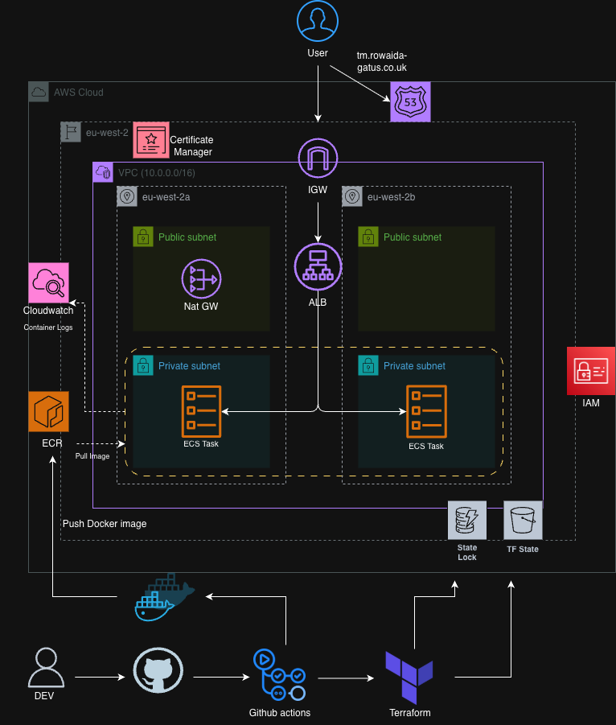
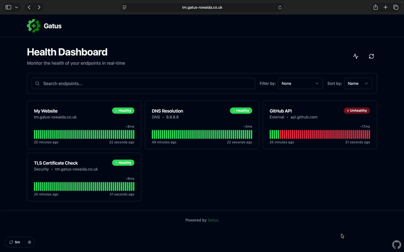
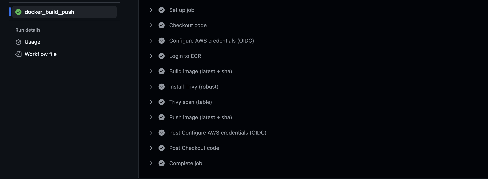
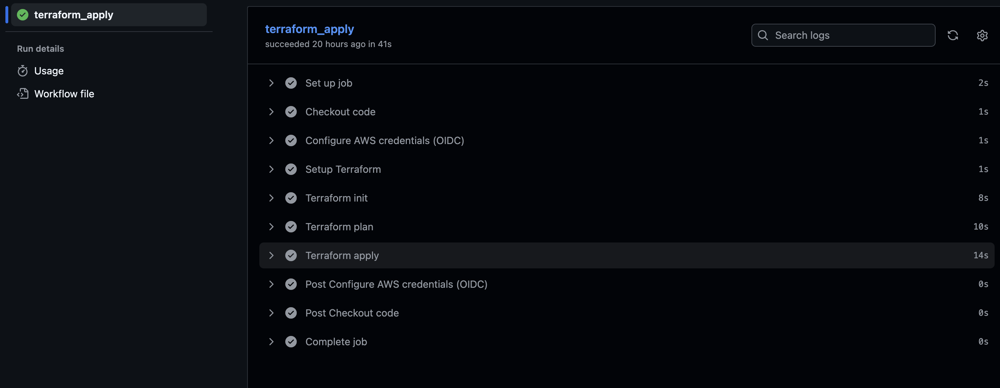
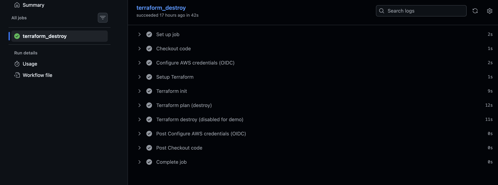

# Gatus ECS Monitoring Infrastructure

This project shows how to deploy Gatus, an open-source health monitoring tool, on AWS ECS Fargate using Terraform and GitHub Actions. It demonstrates how to containerise an application, be pushed to Amazon ECR, and deployed to AWS with automated workflows.

## What is Gatus? 
Gatus is an open-source health monitoring and status page tool that helps developers and teams monitor the availability and performance of services and endpoints.

It provides a lightweight and highly configurable monitoring solution for tracking application health by:

 - Monitoring endpoints
 - Alerting on failure
 - Visualising service health

Unlike large monitoring stacks, Gatus is designed to be simple, fast, and easy to deploy using containers.


## Architecture



The application is deployed on AWS ECS Fargate behind an Application Load Balancer. Terraform provisions the infrastructure while GitHub Actions builds and pushes the container image to Amazon ECR and applies infrastructure changes automatically.


## App Demo



## Architecture breakdown

User requests are routed through Route53 DNS to an Application Load Balancer (ALB) which forwards traffic to the ECS service running the Gatus container. The container image is stored in Amazon ECR and pulled by the ECS tasks during deployment.

The application runs inside a custom VPC with public and private subnets. The load balancer operates in the public subnets while the ECS tasks run in private subnets to prevent direct internet exposure. Logs from the running containers are sent to CloudWatch Logs, allowing monitoring and debugging of the service.

### Architecural decsions made:
 
 #### Private ECS workloads
- improved security posture
- controlled network entry point
- alignment with common AWS architecture best practices


#### The ALB serves as the single public entry point to the service to ensure: 
- traffic routing to ECS tasks
- health checks for container instances
- TLS termination for HTTPS traffic

The infrastructure is split into separate Terraform modules, each responsible for a specific AWS component to improve readability and make the infrastructure easier to maintain and extend.

### Docker Design Decisions
#### Multi-stage Docker builds
 The Dockerfile uses multi-stage builds to separate the build environment from the runtime environment. This helped me reduce image size by more than **50%**.
This removes unnecessary build dependencies from the final image, resulting in:

- smaller image size
- faster image pulls
- reduced attack surface

#### Non-root container user
- The container runs as a non-root user, which is a common container security best practice.
Running containers as non-root reduces the impact of potential container vulnerabilities.


## CI/CD Pipelines
The project uses GitHub Actions to automate builds and infrastructure updates.

### Docker Build & Push Workflow

This workflow builds the container image for the Gatus application and publishes it to Amazon ECR.

- Uses actions/checkout to pull the latest project code into the runner.
- Uses GitHub’s OpenID Connect integration to assume an IAM role.
- Tags the image with both latest and the commit SHA for version traceability.
- Pushes the built image to the ECR repository.



### Terraform Apply Workflow

This workflow provisions and updates the AWS infrastructure required to run the application.

- Retrieves the Terraform configuration and infrastructure modules.
- Authenticates
- Runs terraform init to configure the remote backend.
- Executes terraform apply (which is manual) to create or update AWS resources



### Terraform Destroy Workflow 

This workflow removes the deployed infrastructure when needed.

- Retrieves the Terraform configuration.
- uthenticate with AWS using OIDC
- Sets up terraform and initialises backend
- Generates destroy plan to preview which resources are to be removed
- Executes terraform destroy (which is manual) to delete all resources


## Repository Structure

```
GATUS/

├── bootstrap
│   ├── main.tf
│   ├── provider.tf
├── gatus-app/
│   ├── config.yaml
│   ├── Dockerfile
│   ├── go.mod
│   ├── go.sum
├── images/
│   ├── ecs-architecture.png
│   └── gatus-demo.gif
├── infra/
│   ├── backend.tf
│   ├── main.tf
│   ├── modules/
│   │   ├── acm/
│   │   ├── alb/
│   │   ├── ecr/
│   │   ├── ecs/
│   │   ├── iam/
│   │   ├── route53/
│   │   ├── security_groups/
│   │   └── vpc/
│   ├── provider.tf
│   ├── terraform.tfvars
│   └── variable.tf
└── README.md
```

## Technologies Used

- AWS ECS Fargate
- Terraform 
- Docker
- Github Actions
- Route53
- Application Load Balancer
- CloudWatch


## Challenges and lesson learned

During the development of this project several infrastructure challenges were encountered, including:

- resolving Docker architecture mismatches between ARM and AMD environments

- debugging ECS task networking and load balancer connectivity

- Implementing secure AWS authentication using GitHub OIDC instead of static credentials

- configuring Terraform remote state and backend bootstrapping

Addressing these challenges helped deepen understanding of container deployment, cloud networking, and automated infrastructure workflows.
